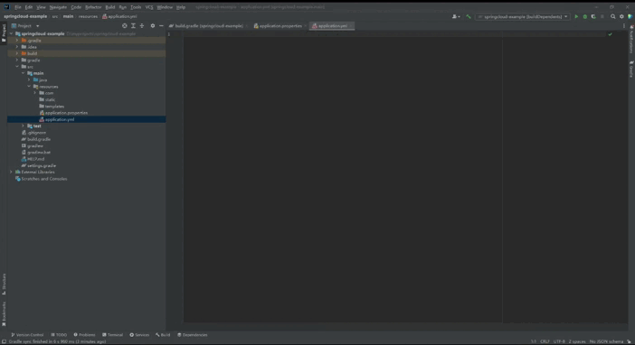

# wl Spring Assistant

#### 介绍
This plugin adds auto-completion support for Spring Boot configuration files (application.yml, application.properties).

#### 安装教程
file -> setting -> plugins
搜索wl spring assistant，点击install

#### 使用说明

<video width="640" height="360" controls>
  <source src="IMG/configurationPropertiesAutoCompletion.mp4" type="video/mp4">
</video>
